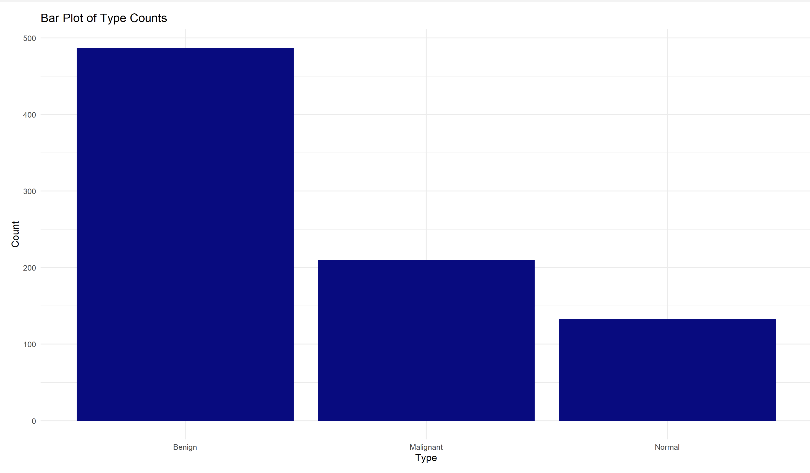

# DS4002-CS2

## Table of Contents
**1. Hook Document**

**2. Rubric**

**3. Various Materials**
- Relevant Articles:
  - These articles are included to provide context and information around the case study topic.
- SRC:
  - This folder contains all of the source code for our project. This folder contains all code used to load and combine the image data as well as structure the final model for training.
- DATA:
  - This folder is where we store all datasets being used for this project. Specifically it has three subfolders that contain all image data for the respective kind of tumor that the image displays (benign, malignant, or normal). Within each of these folders, the images are further divided into two folders titled "full" or "masked" based on the image type.
- Figures:
  -  This folder contains exploratory plots looking into the distribution of data between the three types of tumors. This folder should be populated with any additional exploratory or result plots created.

## Hook Document
- Link to Document: https://docs.google.com/document/d/1GmsvIRSqqhp4ce9Q6sBaSj5Hig9wb_g2pFEXYYaSpXY/edit?usp=sharing

## Rubric
- Link to Rubric: https://docs.google.com/document/d/1u9jtmI0qhVIF2E45JgMPDHbCnlXABrwEiZHp5QPYpuk/edit?usp=sharing

## Articles
- 

## SRC
### Installing/ Building our code
- It is recommended to run the notebook files in an IDE that supports both Jupyter Notebooks and R markdown files such as Pycharm.
- These files use the 'tidyverse' and 'dplyr' R libraries and the json, re, pickle, numpy, pandas and sklearn Python libraries
- File paths may be incorrect on your machine, you are recommended to check all file paths before running.

### Notebook Files
| Notebook Name | Decription |
| -------- | -------- |
| transfer_learning.ipynb | This notebook contains all code used for the completion of the project. This includes data cleaning, creating the dataset, transfer learning with MobileNetV2, and fine tuning the model. |

### Usage
- To use this model, first unpickle it. Then call the sklearn method predict(data) to get predictions.

## DATA
### Dataset Dictionary
| Column Name | Definition | 
| -------- | -------- |
| Image | Breast Ultrasound Image file (json format)|
| Classification | Type of tumor (benign, malignant, or normal)|

## Figures
| Figure | Takeaways | 
| -------- | -------- |
|   | This plot was used during the exploratory phase of the project. It provided a way to visualize the spread of the data across the three possible types of ultrasound images. From this plot we were able to see that benign had the most image data while normal has by far the least. |

## References
[1] W. Al-Dhabyani, M. Gomaa, H. Khaled, and A. Fahmy, "Dataset of breast ultrasound images," Data in Brief, vol. 28, p. 104863, 2020. [Online]. Available: https://doi.org/10.1016/j.dib.2019.104863.

[2] G. Ayana, K. Dese, and S. Choe, "Transfer Learning in Breast Cancer Diagnoses via Ultrasound Imaging," Cancers, vol. 13, no. 4, p. 738, 2021. [Online]. Available: https://doi.org/10.3390/cancers13040738.

[3] F. Chollet, "Data Preprocessing," TensorFlow, 2017. [Online]. Available: https://www.tensorflow.org/tutorials/images/transfer_learning#data_preprocessing. 
